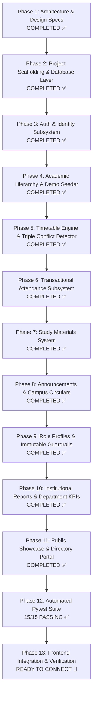

# CMS Backend Implementation Plan & Dependency Map

> **Status**: Verified & Production-Ready  
> **Target Framework**: Python 3.12+ | FastAPI | SQLAlchemy 2.0 (Async) | Alembic | PostgreSQL (Supabase Compatible)  
> **Related Design Specs**:
> * 🗄️ [Database Architecture & Schema (22 Tables)](file:///d:/CMS-REACT-NATIVE/DATABASE_DESIGN.md)
> * 🌐 [REST API Specification (`/api/v1`)](file:///d:/CMS-REACT-NATIVE/API_SPECIFICATION.md)
> * 🛡️ [RBAC & Authorization Matrix](file:///d:/CMS-REACT-NATIVE/AUTHORIZATION_MATRIX.md)
> * 📱 [Frontend Architecture & Screen Inventory](file:///d:/CMS-REACT-NATIVE/frontend.md)

---

## 1. Complete Frontend-to-Backend Dependency Map

Every React Native screen is mapped through its required REST endpoints, backend service methods, and database tables (all 22 tables represented):

| Frontend Screen | React Native File | API Endpoint(s) | Backend Service Method | Database Tables Accessed |
| :--- | :--- | :--- | :--- | :--- |
| **Login Gateway** | `LoginPage.js`, `StudentLogin.js`, `StaffLogin.js`, `AdminLogin.js` | `POST /api/v1/auth/login`<br>`POST /api/v1/auth/refresh`<br>`POST /api/v1/auth/logout` | `AuthService.login()`<br>`AuthService.refresh_token()`<br>`AuthService.logout()` | `users`, `students`, `staff`, `admin_profiles`, `refresh_tokens` |
| **Public Showcase** | `CommonPortal.js` | `GET /api/v1/public/department/showcase`<br>`GET /api/v1/announcements` | `PublicService.get_showcase()`<br>`AnnouncementService.list_announcements()` | `departments`, `staff`, `courses`, `rooms`, `announcements` |
| **Campus Circulars Hub** | `CommonPortal.js` (`CircularsScreen`), `StudentDashboard.js` (Modal) | `GET /api/v1/announcements`<br>`GET /api/v1/announcements/{id}` | `AnnouncementService.list_announcements()`<br>`AnnouncementService.get_announcement()` | `announcements`, `announcement_recipients`, `departments`, `batches`, `sections` |
| **Student Dashboard** | `StudentDashboard.js` | `GET /api/v1/attendance/student/summary`<br>`GET /api/v1/timetable/student?day_of_week=today`<br>`GET /api/v1/announcements?limit=5` | `AttendanceService.get_student_summary()`<br>`TimetableService.get_student_schedule()`<br>`AnnouncementService.list_announcements()` | `students`, `attendance_records`, `attendance_sessions`, `timetable_entries`, `courses`, `announcements`, `academic_years` |
| **Student Timetable** | `StudentTimetable.js` | `GET /api/v1/timetable/student` | `TimetableService.get_student_schedule()` | `timetable_entries`, `periods`, `courses`, `rooms`, `staff`, `sections`, `semesters` |
| **Student Attendance Detail** | `StudentAttendanceDetail.js` | `GET /api/v1/attendance/student/summary` | `AttendanceService.get_student_summary()` | `attendance_records`, `attendance_sessions`, `timetable_entries`, `courses`, `staff` |
| **Study Materials** | `StudyMaterials.js` | `GET /api/v1/materials`<br>`GET /api/v1/materials/{id}/download` | `MaterialService.list_materials()`<br>`MaterialService.track_download()` | `materials`, `material_downloads`, `courses`, `staff` |
| **Student Profile & Edit** | `StudentProfile.js`, `StudentEditProfile.js` | `GET /api/v1/profiles/me`<br>`PUT /api/v1/profiles/me` | `UserService.get_profile()`<br>`UserService.update_student_profile()` | `users`, `students`, `departments`, `batches`, `sections`, `staff` (mentor FK) |
| **Staff Dashboard** | `StaffDashboard.js` | `GET /api/v1/timetable/staff?day_of_week=today`<br>`GET /api/v1/reports/faculty/workload` | `TimetableService.get_staff_schedule()`<br>`ReportService.get_faculty_workload()` | `staff`, `timetable_entries`, `attendance_sessions`, `courses`, `sections` |
| **Staff Timetable** | `StaffTimetable.js` | `GET /api/v1/timetable/staff` | `TimetableService.get_staff_schedule()` | `timetable_entries`, `periods`, `courses`, `rooms`, `sections`, `attendance_sessions` |
| **Mark Attendance** | `MarkAttendance.js` | `GET /api/v1/attendance/session/students`<br>`POST /api/v1/attendance/submit` | `AttendanceService.get_session_roster()`<br>`AttendanceService.submit_session_attendance()` | `timetable_entries`, `sections`, `students`, `attendance_sessions`, `attendance_records`, `audit_logs` |
| **Attendance Review** | `AttendanceReview.js` | `POST /api/v1/attendance/submit` | `AttendanceService.submit_session_attendance()` | `attendance_sessions`, `attendance_records`, `audit_logs` |
| **Staff Notes Upload** | `StaffNotes.js` | `POST /api/v1/materials/upload`<br>`DELETE /api/v1/materials/{id}` | `MaterialService.upload_material()`<br>`MaterialService.delete_material()` | `materials`, `courses`, `staff`, `audit_logs` |
| **Staff Profile & Edit** | `StaffProfile.js`, `StaffEditProfile.js` | `GET /api/v1/profiles/me`<br>`PUT /api/v1/profiles/me` | `UserService.get_profile()`<br>`UserService.update_staff_profile()` | `users`, `staff`, `departments` |
| **Admin Dashboard** | `AdminDashboard.js` | `GET /api/v1/reports/department/summary`<br>`GET /api/v1/admin/audit-logs` | `ReportService.get_department_kpis()`<br>`AuditService.get_recent_logs()` | `departments`, `students`, `staff`, `attendance_records`, `audit_logs` |
| **Admin Timetable Grid** | `AdminTimetable.js` | `GET /api/v1/timetable/admin`<br>`POST /api/v1/timetable/entries`<br>`PUT /api/v1/timetable/entries/{id}`<br>`DELETE /api/v1/timetable/entries/{id}` | `TimetableService.get_section_master()`<br>`TimetableService.create_entry_with_conflict_check()`<br>`TimetableService.update_entry()`<br>`TimetableService.delete_entry()` | `timetable_entries`, `periods`, `courses`, `rooms`, `staff`, `sections`, `course_offerings`, `audit_logs` |
| **Attendance Audit History** | `AttendanceHistory.js` | `GET /api/v1/attendance/history` | `AttendanceService.get_attendance_history()` | `attendance_sessions`, `attendance_records`, `timetable_entries`, `sections`, `courses`, `staff` |
| **Report Management** | `ReportManagement.js` | `GET /api/v1/reports/attendance/defaulters`<br>`GET /api/v1/reports/faculty/workload`<br>`GET /api/v1/reports/department/summary` | `ReportService.get_defaulters_report()`<br>`ReportService.get_faculty_workload()`<br>`ReportService.get_department_kpis()` | `students`, `attendance_records`, `timetable_entries`, `staff`, `courses`, `sections` |
| **Admin Profile & Edit** | `AdminProfile.js`, `AdminEditProfile.js` | `GET /api/v1/profiles/me`<br>`PUT /api/v1/profiles/me` | `UserService.get_profile()`<br>`UserService.update_admin_profile()` | `users`, `admin_profiles`, `departments` |

---

## 2. Target Project Architecture (`fastapi-pro` Pattern)

The backend follows a **Modular Monolith** pattern organized cleanly by functional domain, strictly separating API transport, business logic, and database persistence:

```
backend/
├── app/
│   ├── __init__.py
│   ├── main.py                     # FastAPI application factory, lifespan, CORS, middleware
│   ├── core/                       # Core infrastructure & cross-cutting concerns
│   │   ├── __init__.py
│   │   ├── config.py               # Pydantic Settings V2 (.env parsing)
│   │   ├── database.py             # Async SQLAlchemy 2.0 engine & sessionmaker
│   │   ├── security.py             # Argon2id password hashing, JWT creation & decoding
│   │   ├── dependencies.py         # get_db, get_current_user, require_role, get_optional_user
│   │   └── exceptions.py           # Global exception handlers & custom HTTP status mappings
│   ├── models/                     # SQLAlchemy 2.0 Declarative Models (All 22 Tables)
│   │   ├── __init__.py             # Exports all models so Alembic autogenerates cleanly
│   │   ├── base.py                 # Declarative Base with UUID PK, timestamps, is_active mixins
│   │   ├── user.py                 # users, refresh_tokens
│   │   ├── organization.py         # departments, academic_years, semesters, batches, sections
│   │   ├── profiles.py             # students, staff, admin_profiles
│   │   ├── academics.py            # courses, rooms, periods, course_offerings
│   │   ├── timetable.py            # timetable_entries
│   │   ├── attendance.py           # attendance_sessions, attendance_records
│   │   ├── materials.py            # materials, material_downloads
│   │   ├── announcements.py        # announcements, announcement_recipients
│   │   └── audit.py                # audit_logs
│   ├── schemas/                    # Pydantic V2 Request & Response Data Contracts
│   │   ├── __init__.py
│   │   ├── common.py               # StandardResponse[T], ErrorResponse, PaginationMetadata
│   │   ├── auth.py                 # LoginRequest, TokenResponse, RefreshTokenRequest
│   │   ├── profile.py              # StudentProfileResponse, StaffProfileResponse, ProfileUpdateRequests
│   │   ├── academic.py             # DepartmentResponse, CourseResponse, SectionResponse, RoomResponse
│   │   ├── timetable.py            # TimetableEntryCreate, TimetableEntryResponse, ConflictCheckSchema
│   │   ├── attendance.py           # AttendanceSubmitRequest, AttendanceSummaryResponse, RosterResponse
│   │   ├── materials.py            # MaterialCreateRequest, MaterialResponse, MaterialFilterParams
│   │   ├── announcements.py        # AnnouncementCreateRequest, AnnouncementResponse
│   │   └── reports.py              # DefaulterReportSchema, FacultyWorkloadSchema, DepartmentKpiSchema
│   ├── services/                   # Pure Business Logic Layer (Transaction Managed)
│   │   ├── __init__.py
│   │   ├── auth_service.py         # Multi-identifier login verification & JWT rotation
│   │   ├── user_service.py         # Profile fetching & safe field updating
│   │   ├── academic_service.py     # Departments, Batches, Sections, Courses CRUD
│   │   ├── timetable_service.py    # Triple-conflict validation & dynamic status computer
│   │   ├── attendance_service.py   # Atomic marking transaction & 75% attendance calculator
│   │   ├── material_service.py     # Local/S3 storage adapter & download tracking
│   │   ├── announcement_service.py # Targeted circular filtering & lifecycle
│   │   ├── report_service.py       # Defaulters generator & workload analytics
│   │   └── audit_service.py        # Async structured security logging
│   └── routers/                    # FastAPI APIRouter endpoints
│       ├── __init__.py
│       ├── auth.py                 # /api/v1/auth
│       ├── profiles.py             # /api/v1/profiles
│       ├── academic.py             # /api/v1/academic
│       ├── timetable.py            # /api/v1/timetable
│       ├── attendance.py           # /api/v1/attendance
│       ├── materials.py            # /api/v1/materials
│       ├── announcements.py        # /api/v1/announcements
│       ├── reports.py              # /api/v1/reports
│       └── public.py               # /api/v1/public
├── alembic/
│   ├── env.py                      # Configured for async SQLAlchemy engine & target_metadata
│   ├── script.py.mako
│   └── versions/                   # Migration revision scripts
├── scripts/
│   ├── __init__.py
│   └── seed_demo_data.py           # Idempotent demo seeder matching React Native UI mock data
├── tests/
│   ├── __init__.py
│   ├── conftest.py                 # Async test client fixture & SQLite/Postgres test DB setup
│   ├── test_auth.py                # Multi-role login, invalid credentials, JWT expiry
│   ├── test_timetable.py           # Triple conflict detection (faculty, room, section)
│   ├── test_attendance.py          # Atomic submission, duplicate marking rejection, 75% formula
│   ├── test_materials.py           # Upload, filtering by chip, download count increment
│   └── test_rbac.py                # Strict server-side role denial checks (403 Forbidden)
├── alembic.ini
├── requirements.txt                # Exact pinned dependencies
├── .env.example                    # All required environment variables documented
└── README.md                       # Setup, migration, and execution instructions
```

---

## 3. Phased Implementation Roadmap & Execution Gates



---

### Phase 1: Architecture & Design Specifications — `COMPLETED ✅`
* [x] **Frontend Screen Audit**: All 24 screens examined for UI fields and interaction states.
* [x] **Database Schema**: 22 tables normalized in 3NF, indexed, and cross-checked against UI.
* [x] **REST API Specification**: Standard envelopes, pagination, endpoints, and error codes defined.
* [x] **RBAC Matrix**: Server-side authorization rules documented for Student, Staff, and Admin roles.

---

### Phase 2: Project Scaffolding & Database Foundation
**Goal**: Create a robust, async-first FastAPI foundation with automated migrations and unified response formatting.

* **Tasks**:
  1. Initialize `backend/` directory and configure `requirements.txt`:
     * `fastapi>=0.115.0`, `uvicorn[standard]>=0.30.0`
     * `sqlalchemy[asyncio]>=2.0.35`, `asyncpg>=0.29.0`, `alembic>=1.13.0`
     * `pydantic>=2.8.0`, `pydantic-settings>=2.4.0`
     * `pwdlib[argon2]>=0.2.0`, `pyjwt[crypto]>=2.9.0`
     * `python-multipart>=0.0.9`, `aiofiles>=24.1.0`
     * `pytest>=8.3.0`, `pytest-asyncio>=0.24.0`, `httpx>=0.27.0`
  2. Implement `app/core/config.py` using `pydantic-settings` to parse `.env` (Database URL, JWT Secret, Token Expiry, Allowed CORS Origins).
  3. Implement `app/core/database.py` with async SQLAlchemy engine, connection pooling (`pool_size=20`, `max_overflow=10`), and `get_db` generator.
  4. Implement `app/core/exceptions.py` registering global handlers for `HTTPException`, `RequestValidationError`, and unexpected exceptions, ensuring all responses return the standard envelope:
     ```json
     { "success": false, "error": { "code": "...", "message": "...", "details": ... } }
     ```
  5. Initialize Alembic with async PostgreSQL driver and verify clean migration generation across all 22 models.
* **Definition of Done**:
  * `uvicorn app.main:app` boots cleanly without warnings.
  * `alembic upgrade head` creates all 22 tables and indexes in PostgreSQL.
  * `GET /health` returns `{ "success": true, "data": { "status": "healthy" } }`.

---

### Phase 3: Auth & Identity Subsystem (`/api/v1/auth`)
**Goal**: Secure, multi-role authentication verifying students, faculty, and administrators with JWT rotation.

* **Tasks**:
  1. Implement `app/core/security.py`:
     * Password hashing via Argon2id (resistant to GPU attacks).
     * Access JWT generation (1 hour expiry) containing `sub` (user_id), `role`, and `identifier`.
     * Cryptographically secure 64-char hex refresh tokens stored in `refresh_tokens` table.
  2. Implement `AuthService.login()`:
     * Accepts identifier (Roll No `CS2024-001`, Faculty ID `FAC-2024-001`, or Admin username `admin`).
     * Validates credentials against `users` and linked profile table.
     * Enforces `is_active` check.
     * Updates `last_login` timestamp and issues token pair.
  3. Implement token refresh with automatic token rotation and reuse detection.
  4. Implement `app/core/dependencies.py`:
     * `get_current_user`: Decodes JWT, validates user exists and is active.
     * `require_role(["STUDENT", "STAFF", "ADMIN"])`: Strict server-side RBAC guard.
* **Definition of Done**:
  * Successful login for student, staff, and admin accounts.
  * 401 Unauthorized returned for wrong password or invalid token.
  * 403 Forbidden returned when a student accesses staff/admin routes.

---

### Phase 4: Academic Hierarchy & Demo Seeder Script
**Goal**: Establish institutional master data and seed demo records mirroring the React Native frontend mock data.

* **Tasks**:
  1. Implement models and CRUD endpoints for Academic entities:
     * Departments, Academic Years, Semesters, Batches, Sections.
     * Courses (Theory, Lab, Elective), Rooms (Theory Wing, Lab Wing, Turing Hall), Periods (P1–P7 with breaks).
     * Course Offerings linking Courses, Staff, Sections, and Semesters.
  2. Develop `scripts/seed_demo_data.py`:
     * Seeds Department: "Artificial Intelligence & Data Science" (`AIDS`).
     * Seeds Academic Year "2024-2025" and Semester 5 / 6.
     * Seeds Batch "2022-2026", Section "A" and Section "B".
     * Seeds Periods P1 through P7 with morning tea break and lunch break.
     * Seeds Demo Users:
       * Student: `CS2024-001` (Arjun Patel, Section A, CGPA 8.75).
       * Faculty: `FAC-2024-001` (Dr. Kumar, Deep Learning).
       * Faculty: `FAC-2024-002` (Prof. Saravanan M, DBMS).
       * Faculty: `FAC-2024-003` (Dr. Arulprakash P, OS / HOD).
       * Admin: `admin` (Academic Office Suite 101).
* **Definition of Done**:
  * Running `python scripts/seed_demo_data.py` completes idempotently.
  * All master data relationships match the UI screens exactly.

---

### Phase 5: Timetable Engine & Triple-Conflict Detector (`/api/v1/timetable`)
**Goal**: Power the timetable screens with live time-based status calculations and prevent scheduling clashes.

* **Tasks**:
  1. Implement `TimetableService.get_student_schedule()`:
     * Retrieves section schedule for the requested day of week.
     * Intersperses morning tea break (`10:25–10:40`) and lunch break (`12:20–01:10`).
     * Dynamic status computer: evaluates current system time against slot start/end times:
       * `COMPLETED` if slot end time < current time.
       * `IN_PROGRESS` if current time is between start and end time.
       * `UPCOMING` if slot start time > current time.
  2. Implement `TimetableService.get_staff_schedule()`:
     * Returns faculty's assigned teaching periods.
     * Annotates each period with attendance status (`MARKED` or `PENDING`) for today's date.
  3. Implement `TimetableService.create_entry_with_conflict_check()` (Admin):
     * Runs 3 atomic validation queries before creating or updating a slot:
       1. **Room Conflict**: `SELECT 1 FROM timetable_entries WHERE room_id = :r AND day_of_week = :d AND period_id = :p AND is_active = true`
       2. **Faculty Conflict**: `SELECT 1 FROM timetable_entries WHERE staff_id = :s AND day_of_week = :d AND period_id = :p AND is_active = true`
       3. **Section Conflict**: `SELECT 1 FROM timetable_entries WHERE section_id = :sec AND day_of_week = :d AND period_id = :p AND is_active = true`
     * Rejects with HTTP `409 Conflict` describing the exact overlap if any collision occurs.
* **Definition of Done**:
  * Student sees timetable with correct status chips (`Done`, `NOW`, `Upcoming`).
  * Creating a conflicting timetable entry returns 409 Conflict with descriptive message.

---

### Phase 6: Transactional Attendance Subsystem (`/api/v1/attendance`)
**Goal**: Enable high-integrity attendance marking, prevent duplicate entries, and calculate attendance percentages.

* **Tasks**:
  1. Implement `AttendanceService.get_session_roster()`:
     * Validates that the requesting faculty is assigned to the timetable slot.
     * Retrieves all active students in the section ordered by roll number.
     * Checks if attendance has already been submitted for this `(timetable_entry_id, date)`.
  2. Implement `AttendanceService.submit_session_attendance()`:
     * Wrapped in an atomic database transaction (`async with session.begin()`):
       1. Verifies no duplicate session exists.
       2. Inserts `attendance_sessions` row with computed counts:
          * `present_count`, `absent_count`, `od_count`, `total_marked`.
       3. Bulk inserts `attendance_records` mapping each student to `PRESENT`, `ABSENT`, or `ON_DUTY`.
       4. Writes to `audit_logs` record with staff ID and session metrics.
  3. Implement `AttendanceService.get_student_summary()`:
     * Aggregates total conducted hours vs attended hours (`PRESENT` + `ON_DUTY`).
     * Computes overall percentage and per-subject breakdown:
       $$\text{Percentage} = \frac{\text{Attended Hours}}{\text{Conducted Hours}} \times 100$$
     * Assigns status badge: `EXCELLENT` (≥90%), `GOOD` (75–89%), `CRITICAL` (<75%).
     * Computes `max_absences_allowed` before dipping below institutional 75% threshold.
* **Definition of Done**:
  * Faculty can submit attendance for a 60-student class in a single request.
  * Duplicate submission on same slot/date is rejected with `409 Conflict`.
  * Student attendance summary matches the metrics shown in `StudentAttendanceDetail.js`.

---

### Phase 7: Study Materials System (`/api/v1/materials`)
**Goal**: Course material repository with category filtering and download telemetry.

* **Tasks**:
  1. Implement storage adapter (`LocalStorageAdapter` with S3-compatible pluggability).
  2. Implement `MaterialService.upload_material()` (Staff/Admin):
     * Validates file extension and MIME type (PDF, DOCX, PPTX).
     * Stores file with sanitized UUID filename.
     * Creates metadata record in `materials` table.
  3. Implement `MaterialService.list_materials()`:
     * Filterable by `course_id`, `material_type` (`LECTURE_NOTE`, `QUESTION_BANK`, `LAB_MANUAL`, `SYLLABUS`), and unit.
     * Searchable by title and topic.
  4. Implement `MaterialService.track_download()`:
     * Streams file content to client.
     * Atomically increments `downloads_count` and logs entry in `material_downloads`.
* **Definition of Done**:
  * Faculty can upload lecture notes with metadata.
  * Filter chips in `StudyMaterials.js` return matching materials.
  * Download increments counter accurately.

---

### Phase 8: Announcements & Campus Circulars (`/api/v1/announcements`)
**Goal**: Power official circulars in the Common Portal and Student Dashboard.

* **Tasks**:
  1. Implement `AnnouncementService.list_announcements()`:
     * Supports category filtering (`coe`, `placement`, `academic`, `events`).
     * Excludes expired circulars (`WHERE expires_at > NOW() OR expires_at IS NULL`).
     * Tailors feed for authenticated students based on their department, batch, and section.
  2. Implement `AnnouncementService.create_announcement()` (Admin):
     * Creates circular with official reference number, badge, heading, and body.
     * Optionally targets specific departments or sections via `announcement_recipients`.
* **Definition of Done**:
  * Public hub and Student Dashboard circulars modal render active announcements.
  * Filtering by "Controller of Examinations" returns exam notices.

---

### Phase 9: Role Profiles & Immutable Guardrails (`/api/v1/profiles`)
**Goal**: Deliver tailored profile data while strictly protecting academic credentials.

* **Tasks**:
  1. Implement `UserService.get_profile()`:
     * Student: Returns enrollment info, semester, batch, CGPA, mentor details, and parent contact.
     * Staff: Returns cabin number, qualifications, designation, and experience.
     * Admin: Returns office location and departmental governance metadata.
  2. Implement `UserService.update_student_profile()`:
     * Permitted self-service edits: `phone`, `email`, `address`, `parent_phone`, `blood_group`, `avatar_url`.
     * **Strictly Blocked / Immutable**: `id`, `user_id`, `register_number`, `department_id`, `batch_id`, `section_id`, `semester`, `cgpa`.
* **Definition of Done**:
  * Editing phone number or email updates profile successfully.
  * Attempting to alter CGPA or register number in payload is rejected or ignored.

---

### Phase 10: Institutional Reports & Department KPIs (`/api/v1/reports`)
**Goal**: Provide administrative analytics and compliance monitoring.

* **Tasks**:
  1. Implement `ReportService.get_defaulters_report()`:
     * Identifies all students with attendance percentage < threshold (default `75.0%`).
     * Groups by section and course.
  2. Implement `ReportService.get_faculty_workload()`:
     * Calculates total scheduled lecture hours per week and completed sessions per faculty member.
  3. Implement `ReportService.get_department_kpis()`:
     * Aggregates total students, total staff, today's overall attendance rate, and count of defaulters.
* **Definition of Done**:
  * Admin dashboard renders live metrics and KPI cards.
  * Defaulters report flags students below 75% attendance.

---

### Phase 11: Public Showcase & Directory Portal (`/api/v1/public`)
**Goal**: Deliver public-facing campus and department information for unauthenticated users.

* **Tasks**:
  1. Implement `PublicService.get_showcase()`:
     * Department vision, mission, accreditation status (NBA/NAAC).
     * Key metrics (faculty count, student intake, research labs).
     * Curriculum roadmap by semester.
     * Faculty directory with cabin locations and email contacts.
* **Definition of Done**:
  * `CommonPortal.js` loads complete showcase without requiring an authentication token.

---

### Phase 12: Automated Pytest Suite
**Goal**: Guarantee code correctness, security barriers, and transactional integrity.

* **Tasks**:
  1. Set up `tests/conftest.py` with async client and transaction-rollback test database fixture.
  2. Implement test suites:
     * `test_auth.py`: Login, token refresh, invalid credentials, token tampering.
     * `test_timetable.py`: Triple conflict validation (room, staff, section collisions).
     * `test_attendance.py`: Atomic marking, duplicate prevention, 75% calculation logic.
     * `test_materials.py`: Upload restrictions, category filtering, download counter.
     * `test_rbac.py`: Verify that student tokens receive 403 on staff/admin routes.
* **Definition of Done**:
  * `pytest` runs and passes 100% of test cases.

---

### Phase 13: Frontend Integration & Verification
**Goal**: Connect the React Native app to the running backend and verify real workflows.

* **Tasks**:
  1. Configure frontend API client (`src/api/client.js`) pointing to backend base URL (`http://localhost:8000/api/v1`).
  2. Implement auth token storage and Axios/Fetch request interceptor.
  3. Verify key user journeys:
     * Student logs in ➔ views timetable with live statuses ➔ checks attendance breakdown ➔ views circulars.
     * Staff logs in ➔ views today's schedule ➔ marks attendance for Section A ➔ reviews & submits ➔ verifies status updates to "Marked".
     * Admin logs in ➔ views departmental KPIs ➔ views timetable grid ➔ inspects attendance defaulters report.
* **Definition of Done**:
  * End-to-end user workflows function smoothly with real backend data.
