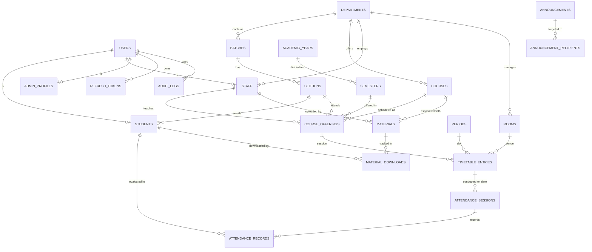

# CMS Database Architecture & Schema Specification (PostgreSQL / Supabase)

---

## ✅ UI Cross-Verification Audit (All Screens Inspected)

Every table and field below has been cross-checked against the actual React Native source code. The verification status of each screen is shown here:

| Screen | File | Key Data Verified |
| :--- | :--- | :--- |
| Student Profile | `StudentProfile.js` | `full_name`, `register_number`, `department`, `batch`, `semester`, `email`, `phone`, `avatar_url`, `faculty_mentor` (mapped to `staff`), `dob`, `blood_group` ✅ |
| Student Edit Profile | `StudentEditProfile.js` | Editable: `full_name`, `email`, `phone`, `parent_phone`, `dob`, `blood_group`, `address`. Locked: `register_number`, `department`, `batch`, `semester`, `cgpa` ✅ |
| Student Dashboard | `StudentDashboard.js` | Academic year badge (`AY 2024-2025 • ODD SEM`), department, college name, active student status ✅ |
| Student Attendance | `StudentAttendanceDetail.js` | Subject `code`, `name`, `credits`, `staff` name, `percentage`, `hours` attended/total, status label ✅ |
| Student Timetable | `StudentTimetable.js` | Period (`P1`–`P7`), `start_time`, `end_time`, course `code`/`name`, `lecture_type`, `room`, faculty name, break entries, status (`Done`/`NOW`/`Upcoming`) ✅ |
| Study Materials | `StudyMaterials.js` | `course_code`, `unit`, `title`, `instructor`, `pages` (page_count), `reads_count`, `file_format` (`PDF`/`DOCX`) ✅ |
| Staff Profile | `StaffProfile.js` | `faculty_id` (FAC-2024-001), `full_name`, `designation`, `department`, `email`, `phone`, `cabin_number`, `experience`, `qualifications` ✅ |
| Mark Attendance | `MarkAttendance.js` | `roll_number`, `name`, attendance `status` (`present`/`absent`/`od`), class date, period, class info ✅ |
| Attendance History | `AttendanceHistory.js` | `date`, `day`, `course` name + code, `period`, `present` count, `total` count, `staff` name ✅ |
| Admin Dashboard | `AdminDashboard.js` | Total students, total staff, today's attendance %, students below 75%, activity feed with `course`, `instructor`, `status`, `time` ✅ |
| Admin Profile | `AdminProfile.js` | `full_name`, `designation`, `email`, `phone`, `office_location` (Office Suite 101) ✅ |
| Report Management | `ReportManagement.js` | Report categories (`attendance`, `student`, `staff`, `department`), recent reports with `name`, `type`, `date`, `format`, `size`, `status` ✅ |

### 🔍 Gaps Found & Fixed in This Version
| Issue | Fix Applied |
| :--- | :--- |
| `students` was missing `date_of_birth` | Added `date_of_birth DATE` column (shown in `StudentEditProfile.js` state: `dob`) |
| `admin_profiles` was missing `office_location` | Added `office_location VARCHAR(128)` (shown in `AdminProfile.js`: "Office of Academic Governance • Suite 101") |
| `students` field `cgpa` is `NUMERIC(3,2)` — max 9.99 | ✅ Correct for GPA scale |
| Attendance status enum uses `od` in UI, `ON_DUTY` in DB | ✅ Correct — frontend normalizes to backend enum on submit |
| `announcement_recipients` table exists in ERD but has no schema | ✅ Added full definition below |

---

## 1. Design Principles & Strategy
1. **Relational Normalization (3NF)**: Structured around institutional hierarchies (`Department` ➔ `Batch` ➔ `Section` ➔ `Student`), separating identity (`users`) from domain roles (`students`, `staff`, `admin_profiles`).
2. **Authoritative Attendance & Uniqueness**: Prevent duplicate attendance through composite unique constraints on `(attendance_session_id, student_id)` and `(timetable_entry_id, date)`.
3. **Optimized Indexes & Query Execution**: Composite indexes on high-frequency search paths (`[section_id, day_of_week]`, `[student_id, date]`, `[course_id, material_type]`).
4. **Soft Deletes & Audit Trails**: Critical master records utilize `is_active` flags; sensitive modifications (attendance changes, timetable edits) write to `audit_logs`.
5. **Universal Compatibility**: Standard PostgreSQL types (UUIDs, TIMESTAMPTZ, JSONB, ENUMs) compatible with local PostgreSQL and Supabase PostgreSQL.

---

## 2. Entity Relationship Diagram (Mermaid)



---

## 3. Relational Schema & Table Definitions

### 3.1. Authentication & User Management

#### `users`
| Column | Type | Constraints | Description |
| :--- | :--- | :--- | :--- |
| `id` | UUID | PRIMARY KEY, default `gen_random_uuid()` | Unique internal user identifier |
| `identifier` | VARCHAR(64) | NOT NULL, UNIQUE, INDEX | Login ID (Roll No, Faculty ID, or Admin username) |
| `password_hash` | VARCHAR(255) | NOT NULL | Argon2id / bcrypt hashed credential |
| `role` | VARCHAR(20) | NOT NULL | `STUDENT`, `STAFF`, `ADMIN` |
| `is_active` | BOOLEAN | NOT NULL, DEFAULT `true` | Account active status |
| `last_login` | TIMESTAMPTZ | NULL | Last successful authentication timestamp |
| `created_at` | TIMESTAMPTZ | NOT NULL, DEFAULT `NOW()` | Record creation timestamp |
| `updated_at` | TIMESTAMPTZ | NOT NULL, DEFAULT `NOW()` | Record update timestamp |

#### `refresh_tokens`
| Column | Type | Constraints | Description |
| :--- | :--- | :--- | :--- |
| `id` | UUID | PRIMARY KEY, default `gen_random_uuid()` | Token record ID |
| `user_id` | UUID | NOT NULL, FK ➔ `users(id)` ON DELETE CASCADE | Owner user |
| `token_hash` | VARCHAR(255) | NOT NULL, UNIQUE, INDEX | SHA256 hashed refresh token |
| `device_info` | VARCHAR(255) | NULL | Device / client agent info |
| `expires_at` | TIMESTAMPTZ | NOT NULL | Token expiry timestamp |
| `revoked_at` | TIMESTAMPTZ | NULL | Revocation timestamp if logged out |
| `created_at` | TIMESTAMPTZ | NOT NULL, DEFAULT `NOW()` | Token issuance timestamp |

---

### 3.2. Organizational Structure

#### `departments`
| Column | Type | Constraints | Description |
| :--- | :--- | :--- | :--- |
| `id` | UUID | PRIMARY KEY, default `gen_random_uuid()` | Department ID |
| `code` | VARCHAR(16) | NOT NULL, UNIQUE | e.g., `AIDS`, `CSE`, `ECE`, `MECH` |
| `name` | VARCHAR(128) | NOT NULL | Department Name |
| `description` | TEXT | NULL | Department overview |
| `vision` | TEXT | NULL | Department vision statement |
| `is_active` | BOOLEAN | NOT NULL, DEFAULT `true` | Active status |

#### `academic_years`
| Column | Type | Constraints | Description |
| :--- | :--- | :--- | :--- |
| `id` | UUID | PRIMARY KEY | Academic year ID |
| `name` | VARCHAR(32) | NOT NULL, UNIQUE | e.g., `2024-2025` |
| `start_date` | DATE | NOT NULL | Start date |
| `end_date` | DATE | NOT NULL | End date |
| `is_current` | BOOLEAN | NOT NULL, DEFAULT `false` | Active academic year indicator |

#### `semesters`
| Column | Type | Constraints | Description |
| :--- | :--- | :--- | :--- |
| `id` | UUID | PRIMARY KEY | Semester ID |
| `academic_year_id` | UUID | NOT NULL, FK ➔ `academic_years(id)` | Parent academic year |
| `semester_number` | SMALLINT | NOT NULL | Semester number (1 to 8) |
| `start_date` | DATE | NOT NULL | Semester start date |
| `end_date` | DATE | NOT NULL | Semester end date |
| `is_current` | BOOLEAN | NOT NULL, DEFAULT `false` | Active semester indicator |

#### `batches`
| Column | Type | Constraints | Description |
| :--- | :--- | :--- | :--- |
| `id` | UUID | PRIMARY KEY | Batch ID |
| `department_id` | UUID | NOT NULL, FK ➔ `departments(id)` | Parent department |
| `year_name` | VARCHAR(32) | NOT NULL | e.g., `2022-2026` |
| `start_year` | INT | NOT NULL | e.g., `2022` |
| `graduation_year` | INT | NOT NULL | e.g., `2026` |

#### `sections`
| Column | Type | Constraints | Description |
| :--- | :--- | :--- | :--- |
| `id` | UUID | PRIMARY KEY | Section ID |
| `batch_id` | UUID | NOT NULL, FK ➔ `batches(id)` | Parent batch |
| `name` | VARCHAR(16) | NOT NULL | e.g., `A`, `B` |
| `current_semester_id`| UUID | NOT NULL, FK ➔ `semesters(id)` | Current active semester |

---

### 3.3. Profiles & Role Entities

#### `students`
| Column | Type | Constraints | Description |
| :--- | :--- | :--- | :--- |
| `id` | UUID | PRIMARY KEY, default `gen_random_uuid()` | Student ID |
| `user_id` | UUID | NOT NULL, UNIQUE, FK ➔ `users(id)` | Linked user account |
| `register_number` | VARCHAR(32) | NOT NULL, UNIQUE, INDEX | University Register Number (e.g. `714022AD001`, `21AD042`) |
| `roll_number` | VARCHAR(32) | NOT NULL, UNIQUE, INDEX | College Roll Number (e.g. `CS2024-001`) |
| `full_name` | VARCHAR(128) | NOT NULL | Student Full Name |
| `department_id` | UUID | NOT NULL, FK ➔ `departments(id)` | Department |
| `batch_id` | UUID | NOT NULL, FK ➔ `batches(id)` | Batch — e.g., `2022-2026` |
| `section_id` | UUID | NOT NULL, FK ➔ `sections(id)` | Section (e.g., Section A) |
| `cgpa` | NUMERIC(3, 2) | NOT NULL, DEFAULT `0.00` | Current CGPA (0.00 – 9.99 scale) |
| `date_of_birth` | DATE | NULL | Date of Birth (**verified from `StudentEditProfile.js` state `dob`**) |
| `phone` | VARCHAR(20) | NULL | Student Mobile Number |
| `email` | VARCHAR(128) | NULL | Student Email |
| `parent_name` | VARCHAR(128) | NULL | Parent / Guardian Name |
| `parent_phone` | VARCHAR(20) | NULL | Parent Contact Number (**verified from `StudentEditProfile.js` state `parentPhone`**) |
| `blood_group` | VARCHAR(8) | NULL | e.g., `O+ve`, `B+ve` (**verified from `StudentEditProfile.js` state `bloodGroup`**) |
| `address` | TEXT | NULL | Residential Address (**verified from `StudentEditProfile.js` state `address`**) |
| `avatar_url` | TEXT | NULL | Profile image URL |
| `faculty_mentor_id` | UUID | NULL, FK ➔ `staff(id)` | Assigned faculty mentor (**verified from `StudentProfile.js` `DetailRow` "Faculty Mentor"**) |

#### `staff`
| Column | Type | Constraints | Description |
| :--- | :--- | :--- | :--- |
| `id` | UUID | PRIMARY KEY, default `gen_random_uuid()` | Staff ID |
| `user_id` | UUID | NOT NULL, UNIQUE, FK ➔ `users(id)` | Linked user account |
| `faculty_id` | VARCHAR(32) | NOT NULL, UNIQUE, INDEX | Institutional Faculty ID (e.g. `FAC-AD-012`) |
| `full_name` | VARCHAR(128) | NOT NULL | Faculty Full Name |
| `department_id` | UUID | NOT NULL, FK ➔ `departments(id)` | Department |
| `designation` | VARCHAR(64) | NOT NULL | e.g. `Associate Professor`, `HOD` |
| `cabin_number` | VARCHAR(32) | NULL | e.g. `Cabin #312`, `HOD Office` |
| `phone` | VARCHAR(20) | NULL | Mobile Number |
| `email` | VARCHAR(128) | NOT NULL | Institutional Email |
| `qualifications` | VARCHAR(128) | NULL | e.g. `M.Tech, Ph.D.` |
| `experience` | VARCHAR(64) | NULL | e.g. `12+ Years` |
| `research_areas` | TEXT | NULL | e.g. `Computer Vision, NLP, Deep Learning` |
| `bio` | TEXT | NULL | Faculty Biography |
| `avatar_url` | TEXT | NULL | Profile photo URL |

#### `admin_profiles`
| Column | Type | Constraints | Description |
| :--- | :--- | :--- | :--- |
| `id` | UUID | PRIMARY KEY, default `gen_random_uuid()` | Admin Profile ID |
| `user_id` | UUID | NOT NULL, UNIQUE, FK ➔ `users(id)` | Linked user account |
| `full_name` | VARCHAR(128) | NOT NULL | Administrator Name |
| `department_id` | UUID | NULL, FK ➔ `departments(id)` | Department (NULL if Super Admin) |
| `designation` | VARCHAR(64) | NOT NULL | e.g., `Senior Administrator & Professor of AI&DS` |
| `permission_level`| VARCHAR(32) | NOT NULL, DEFAULT `DEPARTMENT_ADMIN` | `SUPER_ADMIN`, `DEPARTMENT_ADMIN` |
| `office_location` | VARCHAR(128) | NULL | Office location (**verified from `AdminProfile.js`: "Office of Academic Governance • Suite 101"**) |
| `email` | VARCHAR(128) | NOT NULL | Admin Email |
| `phone` | VARCHAR(20) | NULL | Admin Contact |
| `avatar_url` | TEXT | NULL | Admin Avatar |

---

### 3.4. Academics, Courses & Facilities

#### `courses`
| Column | Type | Constraints | Description |
| :--- | :--- | :--- | :--- |
| `id` | UUID | PRIMARY KEY, default `gen_random_uuid()` | Course ID |
| `department_id` | UUID | NOT NULL, FK ➔ `departments(id)` | Department offering the course |
| `course_code` | VARCHAR(16) | NOT NULL, UNIQUE, INDEX | e.g., `CS3351`, `AD3501`, `CS3301` |
| `course_name` | VARCHAR(128) | NOT NULL | e.g., `Machine Learning`, `Data Structures` |
| `short_name` | VARCHAR(32) | NULL | e.g., `ML`, `DSA`, `DBMS` |
| `credits` | SMALLINT | NOT NULL, DEFAULT `3` | Credit count |
| `course_type` | VARCHAR(20) | NOT NULL | `THEORY`, `PRACTICAL`, `INTEGRATED` |

#### `rooms`
| Column | Type | Constraints | Description |
| :--- | :--- | :--- | :--- |
| `id` | UUID | PRIMARY KEY | Room ID |
| `room_number` | VARCHAR(32) | NOT NULL, UNIQUE | e.g., `Room 204`, `Room 302` |
| `room_name` | VARCHAR(64) | NOT NULL | e.g., `Turing Hall`, `AI Lab 2` |
| `room_type` | VARCHAR(32) | NOT NULL | `CLASSROOM`, `LAB`, `SEMINAR_HALL` |
| `capacity` | INT | NOT NULL, DEFAULT `60` | Seating capacity |

#### `periods`
| Column | Type | Constraints | Description |
| :--- | :--- | :--- | :--- |
| `id` | UUID | PRIMARY KEY | Period ID |
| `period_number` | SMALLINT | NOT NULL, UNIQUE | Period number (1 to 7) |
| `name` | VARCHAR(16) | NOT NULL | e.g., `P1`, `P2`, `P3` |
| `start_time` | TIME | NOT NULL | e.g., `08:45:00` |
| `end_time` | TIME | NOT NULL | e.g., `09:35:00` |
| `is_break` | BOOLEAN | NOT NULL, DEFAULT `false` | True for tea break / lunch |

#### `course_offerings`
| Column | Type | Constraints | Description |
| :--- | :--- | :--- | :--- |
| `id` | UUID | PRIMARY KEY, default `gen_random_uuid()` | Course offering ID |
| `course_id` | UUID | NOT NULL, FK ➔ `courses(id)` | Course |
| `semester_id` | UUID | NOT NULL, FK ➔ `semesters(id)` | Semester |
| `section_id` | UUID | NOT NULL, FK ➔ `sections(id)` | Section enrolled |
| `staff_id` | UUID | NOT NULL, FK ➔ `staff(id)` | Assigned Faculty |
| *Constraint* | UNIQUE | `(course_id, section_id, semester_id)` | Single offering per section per semester |

---

### 3.5. Timetable System

#### `timetable_entries`
| Column | Type | Constraints | Description |
| :--- | :--- | :--- | :--- |
| `id` | UUID | PRIMARY KEY, default `gen_random_uuid()` | Timetable entry ID |
| `course_offering_id`| UUID | NULL, FK ➔ `course_offerings(id)` | Course offering (NULL for break) |
| `section_id` | UUID | NOT NULL, FK ➔ `sections(id)` | Target Section |
| `staff_id` | UUID | NULL, FK ➔ `staff(id)` | Assigned Faculty (NULL for break) |
| `room_id` | UUID | NULL, FK ➔ `rooms(id)` | Classroom/Lab venue |
| `period_id` | UUID | NOT NULL, FK ➔ `periods(id)` | Period Slot |
| `day_of_week` | SMALLINT | NOT NULL | 1 (Monday) to 6 (Saturday) |
| `lecture_type` | VARCHAR(32) | NOT NULL | `THEORY`, `PRACTICAL`, `BREAK`, `LUNCH` |
| `title` | VARCHAR(128) | NULL | Custom label (e.g. `Morning Tea Break`) |
| `is_active` | BOOLEAN | NOT NULL, DEFAULT `true` | Active timetable entry |

#### ⚠️ Timetable Database Constraints for Conflict Prevention:
1. **Section Conflict**: `UNIQUE (section_id, day_of_week, period_id)` — A section cannot have two classes simultaneously.
2. **Staff Conflict**: `UNIQUE (staff_id, day_of_week, period_id)` — A faculty member cannot teach two classes simultaneously.
3. **Room Conflict**: `UNIQUE (room_id, day_of_week, period_id)` — A room cannot host two classes simultaneously.

---

### 3.6. Attendance System

#### `attendance_sessions`
| Column | Type | Constraints | Description |
| :--- | :--- | :--- | :--- |
| `id` | UUID | PRIMARY KEY, default `gen_random_uuid()` | Attendance session ID |
| `timetable_entry_id`| UUID | NOT NULL, FK ➔ `timetable_entries(id)` | Timetable slot |
| `date` | DATE | NOT NULL | Class date |
| `staff_id` | UUID | NOT NULL, FK ➔ `staff(id)` | Faculty who marked attendance |
| `submitted_at` | TIMESTAMPTZ | NOT NULL, DEFAULT `NOW()` | Submission timestamp |
| `status` | VARCHAR(20) | NOT NULL, DEFAULT `SUBMITTED` | `SUBMITTED`, `EDITED`, `CANCELLED` |
| *Constraint* | UNIQUE | `(timetable_entry_id, date)` | Prevent multiple submissions for same slot & date |

#### `attendance_records`
| Column | Type | Constraints | Description |
| :--- | :--- | :--- | :--- |
| `id` | UUID | PRIMARY KEY, default `gen_random_uuid()` | Record ID |
| `attendance_session_id` | UUID | NOT NULL, FK ➔ `attendance_sessions(id)` ON DELETE CASCADE | Parent session |
| `student_id` | UUID | NOT NULL, FK ➔ `students(id)` | Student |
| `status` | VARCHAR(16) | NOT NULL | `PRESENT`, `ABSENT`, `ON_DUTY` |
| `marked_at` | TIMESTAMPTZ | NOT NULL, DEFAULT `NOW()` | Marking timestamp |
| *Constraint* | UNIQUE | `(attendance_session_id, student_id)` | One record per student per session |

---

### 3.7. Study Materials & Repository

#### `materials`
| Column | Type | Constraints | Description |
| :--- | :--- | :--- | :--- |
| `id` | UUID | PRIMARY KEY, default `gen_random_uuid()` | Material ID |
| `course_id` | UUID | NOT NULL, FK ➔ `courses(id)` | Associated Course |
| `staff_id` | UUID | NOT NULL, FK ➔ `staff(id)` | Uploading Faculty |
| `title` | VARCHAR(255) | NOT NULL | Document Title |
| `unit` | VARCHAR(32) | NOT NULL | e.g. `Unit 1`, `Unit 2`, `All Units` |
| `topic` | VARCHAR(255) | NULL | Detailed Topic Description |
| `material_type` | VARCHAR(32) | NOT NULL | `LECTURE_NOTE`, `QUESTION_BANK`, `LAB_MANUAL`, `SYLLABUS`, `PREVIOUS_YEAR_PAPER` |
| `file_name` | VARCHAR(255) | NOT NULL | Original filename |
| `file_size_bytes` | BIGINT | NOT NULL | File size in bytes |
| `file_format` | VARCHAR(16) | NOT NULL | `PDF`, `DOCX`, `ZIP` |
| `storage_path` | TEXT | NOT NULL | Storage key / file path |
| `page_count` | INT | NULL | Page count (e.g. 48 Pages) |
| `reads_count` | INT | NOT NULL, DEFAULT 0 | View / read counter |
| `downloads_count` | INT | NOT NULL, DEFAULT 0 | Download counter |
| `is_active` | BOOLEAN | NOT NULL, DEFAULT `true` | Visibility status |
| `created_at` | TIMESTAMPTZ | NOT NULL, DEFAULT `NOW()` | Upload timestamp |
| `updated_at` | TIMESTAMPTZ | NOT NULL, DEFAULT `NOW()` | Last modified timestamp |

#### `material_downloads`
| Column | Type | Constraints | Description |
| :--- | :--- | :--- | :--- |
| `id` | UUID | PRIMARY KEY, default `gen_random_uuid()` | Download entry ID |
| `material_id` | UUID | NOT NULL, FK ➔ `materials(id)` ON DELETE CASCADE | Target Material |
| `student_id` | UUID | NOT NULL, FK ➔ `students(id)` | Downloading Student |
| `downloaded_at`| TIMESTAMPTZ | NOT NULL, DEFAULT `NOW()` | Timestamp |

---

### 3.8. Communication & Announcements

> **UI Source**: `StudentDashboard.js` shows circular/announcement cards with `date`, `title`, `body`, and a `tag` (category). See `circularsData` array with tags: `AU EXAM`, `ACADEMIC`, `EVENTS`.

#### `announcements`
| Column | Type | Constraints | Description |
| :--- | :--- | :--- | :--- |
| `id` | UUID | PRIMARY KEY, default `gen_random_uuid()` | Announcement ID |
| `title` | VARCHAR(255) | NOT NULL | Announcement Headline (**maps to `title` in `circularsData`**) |
| `content` | TEXT | NOT NULL | Full Announcement Body (**maps to `body`**) |
| `category` | VARCHAR(32) | NOT NULL | `ACADEMIC`, `EXAM`, `PLACEMENT`, `EVENTS`, `GENERAL` (**maps to `tag`**) |
| `created_by` | UUID | NOT NULL, FK ➔ `users(id)` | Author user |
| `target_role` | VARCHAR(20) | NOT NULL, DEFAULT `ALL` | `ALL`, `STUDENT`, `STAFF` |
| `is_pinned` | BOOLEAN | NOT NULL, DEFAULT `false` | Pin to top |
| `publish_date` | DATE | NOT NULL, DEFAULT `CURRENT_DATE` | Display date (**maps to `date` field** e.g., `18 OCT 2024`) |
| `expires_at` | TIMESTAMPTZ | NULL | Auto-expiry timestamp |
| `created_at` | TIMESTAMPTZ | NOT NULL, DEFAULT `NOW()` | Creation timestamp |

#### `announcement_recipients`
> Needed for section/batch-targeted announcements (e.g., announce to only "3rd year AI&DS Section A").

| Column | Type | Constraints | Description |
| :--- | :--- | :--- | :--- |
| `id` | UUID | PRIMARY KEY, default `gen_random_uuid()` | Recipient targeting rule ID |
| `announcement_id`| UUID | NOT NULL, FK ➔ `announcements(id)` ON DELETE CASCADE | Parent announcement |
| `department_id` | UUID | NULL, FK ➔ `departments(id)` | Target department (NULL = all) |
| `batch_id` | UUID | NULL, FK ➔ `batches(id)` | Target batch (NULL = all) |
| `section_id` | UUID | NULL, FK ➔ `sections(id)` | Target section (NULL = all) |

---

### 3.9. Security & Audit Logging

#### `audit_logs`
| Column | Type | Constraints | Description |
| :--- | :--- | :--- | :--- |
| `id` | UUID | PRIMARY KEY, default `gen_random_uuid()` | Audit Entry ID |
| `user_id` | UUID | NULL, FK ➔ `users(id)` ON DELETE SET NULL | Acting user |
| `action` | VARCHAR(64) | NOT NULL | e.g. `ATTENDANCE_SUBMIT`, `TIMETABLE_UPDATE` |
| `entity_name` | VARCHAR(64) | NOT NULL | e.g. `attendance_sessions`, `timetable_entries` |
| `entity_id` | VARCHAR(64) | NOT NULL | ID of affected entity |
| `details` | JSONB | NULL | Before/after state diff or metadata |
| `ip_address` | VARCHAR(45) | NULL | Client IP |
| `created_at` | TIMESTAMPTZ | NOT NULL, DEFAULT `NOW()` | Audit timestamp |

---

## 4. Key Performance Indexes

```sql
-- Timetable lookup by section and weekday (StudentTimetable, StaffTimetable, AdminTimetable screens)
CREATE INDEX idx_timetable_section_day ON timetable_entries(section_id, day_of_week) WHERE is_active = true;

-- Timetable lookup by staff and weekday (StaffTimetable screen)
CREATE INDEX idx_timetable_staff_day ON timetable_entries(staff_id, day_of_week) WHERE is_active = true;

-- Attendance session querying by date and timetable entry (AttendanceHistory, MarkAttendance screens)
CREATE INDEX idx_attendance_session_date ON attendance_sessions(date, timetable_entry_id);

-- Attendance records aggregation by student (StudentAttendanceDetail screen)
CREATE INDEX idx_attendance_records_student ON attendance_records(student_id, status);

-- Materials lookup by course and type (StudyMaterials screen filter chips)
CREATE INDEX idx_materials_course_type ON materials(course_id, material_type) WHERE is_active = true;

-- Students lookup by section (MarkAttendance roster, AdminDashboard counts)
CREATE INDEX idx_students_section ON students(section_id);

-- Staff lookup by department (faculty directory in CommonPortal, AdminDashboard)
CREATE INDEX idx_staff_department ON staff(department_id);

-- Announcements by category and target (StudentDashboard circulars)
CREATE INDEX idx_announcements_category ON announcements(category, target_role) WHERE expires_at IS NULL OR expires_at > NOW();

-- Attendance sessions by staff for workload report (ReportManagement)
CREATE INDEX idx_attendance_session_staff ON attendance_sessions(staff_id, date);

-- Materials read/download counts for popularity sorting (StudyMaterials screen)
CREATE INDEX idx_materials_reads ON materials(reads_count DESC) WHERE is_active = true;
```

---

## 5. Table Summary (All 22 Tables)

| # | Table | Domain | UI Screen(s) |
| :-- | :--- | :--- | :--- |
| 1 | `users` | Auth | All Login screens |
| 2 | `refresh_tokens` | Auth | All screens (token refresh) |
| 3 | `departments` | Org | CommonPortal, AdminDashboard, Profiles |
| 4 | `academic_years` | Org | StudentDashboard ("AY 2024-2025") |
| 5 | `semesters` | Org | StudentProfile ("Semester 6"), StudentTimetable |
| 6 | `batches` | Org | StudentProfile ("Batch 2022-2026") |
| 7 | `sections` | Org | MarkAttendance ("III AI & DS - A"), AdminTimetable |
| 8 | `students` | Profile | StudentProfile, StudentEditProfile |
| 9 | `staff` | Profile | StaffProfile, StaffEditProfile, CommonPortal faculty dir |
| 10 | `admin_profiles` | Profile | AdminProfile, AdminEditProfile |
| 11 | `courses` | Academic | StudentTimetable, StudyMaterials, AttendanceDetail |
| 12 | `rooms` | Academic | StudentTimetable, StaffTimetable, AdminTimetable |
| 13 | `periods` | Academic | StudentTimetable (P1–P7 with times) |
| 14 | `course_offerings` | Academic | Timetable, MarkAttendance (class info header) |
| 15 | `timetable_entries` | Timetable | StudentTimetable, StaffTimetable, AdminTimetable |
| 16 | `attendance_sessions` | Attendance | MarkAttendance, AttendanceHistory |
| 17 | `attendance_records` | Attendance | AttendanceReview, StudentAttendanceDetail |
| 18 | `materials` | Materials | StudyMaterials, StaffNotes |
| 19 | `material_downloads` | Materials | StudyMaterials (reads/download counts) |
| 20 | `announcements` | Comms | StudentDashboard (circulars cards) |
| 21 | `announcement_recipients` | Comms | (targeted delivery) |
| 22 | `audit_logs` | Security | AdminDashboard (activity feed), ReportManagement |
