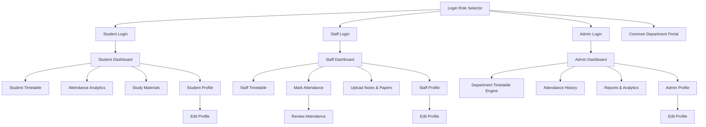

# College Management System (CMS) — Frontend Architecture & Screen Specification

---

## 📱 Executive Overview & Native App Clarification

### ❓ Is this a Website or a Mobile App?
> **This is a native Cross-Platform Mobile Application built with React Native (`v0.86.3`) and Expo SDK (`v57`).**

* **Native Mobile Compilation**: This codebase uses **React Native** components (`<View>`, `<Text>`, `<ScrollView>`, `<TouchableOpacity>`, `<TextInput>`, `<Animated>`) which compile directly to native **Android UI widgets** (`android.view.View`) and native **iOS UI widgets** (`UIView`), rather than browser HTML elements (`
`, `
`, ``).
* **Hardware & Platform Features**: It integrates native mobile capabilities including `react-native-safe-area-context` (notches and device cutouts), native status bar controls, hardware-accelerated fluid screen transitions via `@react-navigation/native-stack`, and vector icon sets (`@expo/vector-icons`).
* **Universal Multi-Platform Support**: Powered by Expo and `react-native-web`, the exact same source code can be:
  1. Built into **Android APK / AAB** for Google Play Store.
  2. Built into **iOS IPA** for Apple App Store.
  3. Run on the Web/Desktop browsers for instant testing and portal access.

---

## 🧭 Navigation Architecture & User Roles

The frontend is structured into 4 role-based access domains:
1. **Authentication & Gateway**: Role selection and dedicated credentials portal.
2. **Student Portal**: Academics, real-time timetable, attendance insights, study material downloads, and profile management.
3. **Faculty / Staff Portal**: Lecture scheduling, period-by-period attendance marking, study notes publishing, and faculty profile.
4. **Admin / Department Head (HOD) Portal**: Institutional timetable management, batch-wide attendance tracking, departmental performance analytics, and audit reports.
5. **Common Campus Hub**: Interactive department showcase, lab facilities, faculty directory, and placement statistics.

---

## 🖥️ Screen-by-Screen Breakdown

### 1. Authentication & Role Gateway

#### 🔑 `LoginPage.js` (Role Selector)
* **Components**: Hero institution logo, decorative animated gradient card, 3 interactive Role Selection Cards (Student, Faculty/Staff, Department Admin), and a quick link to the Department Web Portal / Helpdesk form.
* **Frontend Capabilities**:
  * Acts as the primary entrance to the app.
  * Directs users into their specific authentication flow.
  * Launches external support/inquiry links via native linking (`forms.gle`).

#### 🎓 `StudentLogin.js`
* **Components**: Roll Number / Register Number input, Password field with secure toggle, "Remember Me" checkbox, and Action Login Button.
* **Frontend Capabilities**: Validates student credentials and navigates directly to the Student Dashboard with session context.

#### 👨‍🏫 `StaffLogin.js`
* **Components**: Faculty ID input, Secure Password input, biometric/session toggles, and Action Login Button.
* **Frontend Capabilities**: Authenticates teaching faculty and opens the Staff Workspace.

#### 🏛️ `AdminLogin.js`
* **Components**: Admin / HOD Master ID input, Security Password field, Departmental verification tag, and Submit Button.
* **Frontend Capabilities**: Grants administrative privileges to access institutional controls and reporting.

---

### 2. Common Campus Portal

#### 🌐 `CommonPortal.js` (Campus & Department Showcase)
* **Components**:
  * Hero banner with AI & Data Science vision statement.
  * Quick-stat counters (Student count, Faculty ratio, Placement percentage, Research publications).
  * Interactive curriculum modules & elective roadmaps.
  * Laboratory & infrastructure gallery cards.
  * Faculty profile cards with email and cabin information.
* **Frontend Capabilities**: Provides a public-facing informational showcase of department achievements, faculty profiles, and facilities without requiring a login.

---

### 3. Student Portal

#### 📊 `StudentDashboard.js`
* **Components**:
  * Student Greeting Header with Avatar, Department, and Semester badges.
  * Cumulative Overall Attendance Gauge (e.g., 88.5% with color-coded safety status).
  * "Today's Schedule" snippet highlighting the current active class/room.
  * Quick Action Grid: Timetable, Attendance Breakdown, Notes & Materials, Profile.
  * Recent internal test marks and announcement cards.
  * Integrated `StudentBottomNav`.
* **Frontend Capabilities**: Serves as the personal command center for students to inspect their day at a glance.

#### 📅 `StudentTimetable.js` (Nexus Timetable)
* **Components**:
  * Day Selector Tabs (Monday through Saturday) with active day indicator.
  * Time Slot Cards (Period 1 to Period 7) with:
    * Subject Code & Subject Name.
    * Lecture type (Theory, Practical Lab, Morning Tea Break, Lunch Break).
    * Assigned Classroom / Lab Number.
    * Assigned Faculty Name.
    * Dynamic status pill (`Completed`, `In Progress / Now`, `Upcoming`).
  * Sticky `StudentBottomNav`.
* **Frontend Capabilities**: Allows students to track daily class schedules in real-time, view room locations, and see current ongoing lectures.

#### 📈 `StudentAttendanceDetail.js`
* **Components**:
  * Circular progress percentage indicator with minimum criteria benchmark (75% threshold).
  * Subject-by-subject attendance cards showing `Attended / Total Classes` and percentage.
  * Leave / OD (On Duty) application trigger.
  * Monthly attendance calendar heat-map view.
* **Frontend Capabilities**: Visualizes student attendance metrics and warns when attendance in any subject drops below the mandatory threshold.

#### 📚 `StudyMaterials.js`
* **Components**:
  * Subject filter chips (e.g., Machine Learning, DBMS, Operating Systems, Data Structures).
  * Material Type filters (Lecture Notes, Question Banks, Lab Manuals, Syllabus).
  * Downloadable Resource Cards with file format badge (PDF/DOCX), file size, uploader faculty name, and download action buttons.
* **Frontend Capabilities**: Enables students to search, filter, and access academic resources uploaded by their professors.

#### 👤 `StudentProfile.js` & ✏️ `StudentEditProfile.js`
* **Components**:
  * Profile avatar, Register Number, Department, Batch Year, Academic CGPA.
  * Personal contact info, parent contact, blood group, and residential address.
  * "Edit Profile" screen featuring form inputs for Phone, Email, Address, and Avatar image updates with Save/Cancel triggers.
* **Frontend Capabilities**: Displays and allows editing of personal records and contact details.

---

### 4. Faculty / Staff Portal

#### 📋 `StaffDashboard.js`
* **Components**:
  * Faculty Header with Department Designation and Cabin Number.
  * "Classes Today" counter and quick attendance shortcut.
  * Today's teaching schedule timeline.
  * Quick Action tiles: Mark Attendance, Upload Notes, My Timetable, View Reports.
  * Bottom navigation bar.
* **Frontend Capabilities**: Central workspace for teachers to manage their daily academic responsibilities.

#### 📅 `StaffTimetable.js`
* **Components**:
  * Day Switcher (Mon – Sat).
  * Teaching Period Cards displaying:
    * Assigned Class & Section (e.g., *III AI & DS - A*).
    * Course Title and Code.
    * Room Number / AI Lab.
    * Attendance Status indicator (`Attendance Marked` vs `Pending`).
  * Quick button to jump directly into marking attendance for that specific slot.
  * Bottom navigation bar.
* **Frontend Capabilities**: Shows faculty their assigned teaching workload for the entire week and tracks which periods have already had attendance submitted.

#### ✍️ `MarkAttendance.js` & 🔍 `AttendanceReview.js`
* **Components**:
  * Class selector (Department, Year, Section, Subject, Period).
  * Student Roll Call List with one-tap toggle buttons (`Present` / `Absent` / `On Duty`).
  * Bulk actions: "Mark All Present", "Clear All".
  * Real-time Present/Absent counter summary bar.
  * Confirmation/Review Screen (`AttendanceReview.js`) summarizing total present/absent count before permanent submission.
* **Frontend Capabilities**: Enables professors to mark and submit period attendance for students within seconds.

#### 📑 `StaffNotes.js`
* **Components**:
  * Upload Document Form (Subject selection, Material Title, Unit/Topic, File attachment picker).
  * List of previously uploaded notes with download count and delete options.
  * Previous year question papers and lab manual repository.
* **Frontend Capabilities**: Allows teachers to upload PDF notes and study materials directly to students' portals.

#### 👤 `StaffProfile.js` & ✏️ `StaffEditProfile.js`
* **Components**:
  * Faculty ID, Designation, Qualifications, Experience, Research Areas.
  * Editable fields for phone number, office extension, email, and bio.
* **Frontend Capabilities**: Displays faculty credentials and allows profile details update.

---

### 5. Admin / Department Head (HOD) Portal

#### 🏛️ `AdminDashboard.js`
* **Components**:
  * Department KPI Cards: Total Students Enrolled, Active Staff, Today's Overall Attendance %, Pending Approvals.
  * Quick links to Timetable Master, Attendance Audits, and Performance Reports.
  * Real-time department activity feed.
  * Admin bottom navigation bar.
* **Frontend Capabilities**: Executive dashboard giving the HOD/Admin full visibility over department operations.

#### 🗓️ `AdminTimetable.js`
* **Components**:
  * Section Selector (e.g., *III AI & DS - A*, *III AI & DS - B*, *II AI & DS*).
  * Master Weekly Schedule Grid covering Period 1 to Period 7.
  * Slot detail view displaying Subject, Faculty assigned, Room/Lab venue, and completion metrics.
  * Admin bottom navigation bar.
* **Frontend Capabilities**: Allows administrators to view, monitor, and coordinate timetables across all classes and faculty allocations in the department.

#### 📊 `AttendanceHistory.js`
* **Components**:
  * Date picker and class/section filter dropdowns.
  * Historical attendance log list by date, period, faculty who took the class, and attendance percentage.
  * Discrepancy flagging and search bar.
* **Frontend Capabilities**: Institutional audit log to inspect attendance records for any past date or semester.

#### 📑 `ReportManagement.js`
* **Components**:
  * Report generation cards: Low Attendance Defaulters List (< 75%), Semester Exam Eligibility Report, Faculty Workload Report, Academic Performance Summary.
  * Export options (PDF / Excel formatting placeholders).
* **Frontend Capabilities**: Generates institutional reports for academic meetings and university compliance.

#### 👤 `AdminProfile.js` & ✏️ `AdminEditProfile.js`
* **Components**:
  * Administrator information, Department governance credentials, System permission level, and Contact details.
* **Frontend Capabilities**: Manages administrator account and system preference configurations.

---

## 🧩 Reusable UI Component Library (`/components`)

| Component | File Path | Purpose & Visual Features |
| :--- | :--- | :--- |
| **`TopAppBar`** | [`components/TopAppBar.js`](file:///d:/CMS-REACT-NATIVE/components/TopAppBar.js) | Standardized header featuring screen title, back navigation arrow, optional action icons, and notification badges. |
| **`BottomNavBar`** | [`components/BottomNavBar.js`](file:///d:/CMS-REACT-NATIVE/components/BottomNavBar.js) | Bottom navigation bar for Staff and Admin with active tab highlights, badges, and haptic-ready touch targets. |
| **`StudentBottomNav`** | [`components/StudentBottomNav.js`](file:///d:/CMS-REACT-NATIVE/components/StudentBottomNav.js) | Dedicated student bottom bar (Home, Timetable, Attendance, Materials, Profile). |
| **`NavigationDrawer`** | [`components/NavigationDrawer.js`](file:///d:/CMS-REACT-NATIVE/components/NavigationDrawer.js) | Slide-out side drawer for quick switching across modules, settings, and logout. |

---

## 🔌 Frontend-to-Backend Readiness Summary

All frontend screens are architected with clean component separation, mock datasets, and explicit parameter passing (`route.params` via `@react-navigation/native-stack`).

When integrating your backend:
1. **Authentication Screens** ➡️ Connect to `/api/auth/login` (Returns JWT token + user role).
2. **Timetable Screens** ➡️ Connect to `/api/timetable/:classId` or `/api/timetable/staff/:staffId`.
3. **Attendance Screens** ➡️ Connect to `POST /api/attendance/mark` and `GET /api/attendance/student/:id`.
4. **Study Materials** ➡️ Connect to `/api/materials` (Upload/Download endpoints).
5. **Profiles** ➡️ Connect to `GET /api/user/profile` and `PUT /api/user/profile`.
